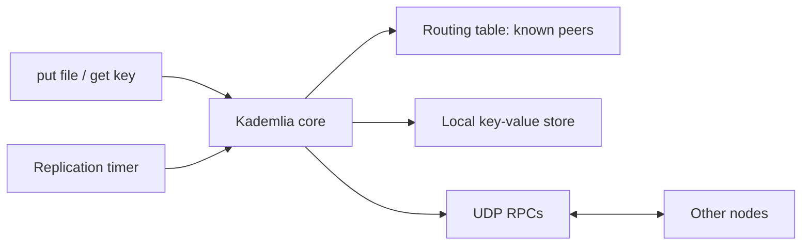

# Understanding and running the project

## What we are building

The assignment is a decentralized package repository: package files live on multiple computers instead of one central server. Part 1 implements the distributed storage underneath it. Part 2 will add package names, owners, signatures, and version history.

One running copy of the Go program is one **node**. A node has:

- An address, such as `127.0.0.1:8001`, and an ID equal to `SHA-256(IP:port)`.
- A **routing table**, which is a contact book for other nodes.
- A **data store**, which holds some file contents in memory.
- A UDP listener, an interactive CLI or headless loop, and a replication worker.

A file's **key** is `SHA-256(file contents)`. The same bytes always have the same key. When receiving bytes for a key, nodes check that the hash matches. This detects incorrect content; Part 2 adds proof of who published it.

Kademlia decides where to store a key using `distance = nodeID XOR key`, interpreted as a number. Smaller numbers are closer. This is distance between identifiers, unrelated to physical location. A lookup asks known peers for contacts closer to the target, then asks those contacts, continuing until it has queried the closest candidates it has found. The initiating node controls the iteration.

The parameter `k` is both the bucket capacity and desired replication factor, defaulting to 10. In a three-node network, only three distinct nodes can hold replicas. `alpha` controls concurrent lookup probes; the code still uses alpha = 1, and adjustable parallel probes remain a team task.



The four network operations are:

| RPC | Meaning |
| --- | --- |
| PING | Are you alive? |
| FIND_NODE | Which contacts do you know closest to this ID? |
| FIND_VALUE | Do you have these bytes? If not, which contacts are closest to the key? |
| STORE | Keep these bytes under this key, after verifying the hash. |

`put` hashes the file, finds the closest nodes, and sends them STORE requests. `get` first checks the local store, then follows FIND_VALUE responses until it finds valid bytes or exhausts its candidates. A successful remote retrieval also saves a local copy.

## Jerald's work and status

The initial core PR, [PR #1](https://github.com/ArianAsghari/d7024e/pull/1), was already merged into Sprint-1. Sprint-2 was created after all three Sprint-1 PRs merged.

| Assigned item | Current status |
| --- | --- |
| Merge the core PR | Already merged |
| PING-based full-bucket eviction | Implemented, with concurrent refresh protection |
| Bootstrap contact and self-lookup | Implemented through `BOOTSTRAP` and `join` |
| Refresh buckets farther than the closest neighbor | Implemented during join |
| Periodic replication without expiration | Implemented; interval defaults to one hour |
| Report thread-safety section | Written in `../REPORT.md` |
| Version records, no forks/rollback, and catch-up | Sprint 3; not implemented in this change |

The latest team message prioritizes joining for tomorrow. This is what joining does:

1. Contact the bootstrap node and insert its contact into the routing table.
2. Run the normal node lookup with **our own ID** as the target. We are discovering neighbors close to where we belong in the ID space.
3. Pick a random target in each farther bucket's range and look it up. This fills out contacts in other parts of the network and introduces us to peers.

The bootstrap is an entry point, not a central database. Once peers have discovered each other, they can communicate directly. New nodes still need a reachable entry point to join. This sequence follows the [original Kademlia paper](https://www.scs.stanford.edu/~dm/home/papers/kpos.pdf), adapted to the lab's 256-bit IDs.

A bucket keeps contacts in recency order. When full, it PINGs the least-recently-seen contact. If that contact responds, it stays; otherwise the newcomer replaces it. This keeps established live peers while making room when peers disappear.

**Churn** means nodes joining and leaving. Periodic replication looks up the current closest peers and sends fresh copies of locally held values. It never deletes values or attaches a TTL. If every copy disappears before another replica is made, the data is lost; replication cannot reconstruct bytes that no node still has.

## Branch workflow

Run Git commands from the repository root. The team repository is called `arian`; `origin` is the course's starter repository.

This checkout is already on Sprint-2. Before starting work with a clean working tree:

```sh
git switch Sprint-2
git pull --ff-only arian Sprint-2
```

For another checkout that does not yet have a local Sprint-2 branch:

```sh
git fetch arian
git switch --track arian/Sprint-2
```

After making and testing a change, stage the specific files you changed, commit, and push to the shared branch. If a teammate pushed first, commit your own changes, run `git pull --rebase arian Sprint-2`, resolve any conflicts, rerun the relevant tests, and then run `git push arian Sprint-2`. Do not force-push the shared branch.

## Run two nodes locally

Go 1.22 or newer is required. Work inside `labs/`, where `go.mod` lives. No Docker is needed for this demonstration.

In terminal A, starting from the repository root:

```sh
cd labs
printf 'hello from Kademlia\n' > /tmp/kademlia-demo.txt
BIND_IP=127.0.0.1 PORT=8001 REPLICATION_INTERVAL=5s go run .
```

In terminal B, also starting from the repository root:

```sh
cd labs
BIND_IP=127.0.0.1 PORT=8002 BOOTSTRAP=127.0.0.1:8001 REPLICATION_INTERVAL=5s go run .
```

B prints `Joined via 127.0.0.1:8001` before its prompt. Type these commands **inside A's node prompt**, not your regular shell:

```text
show rt
put /tmp/kademlia-demo.txt
show ds
```

Copy the full 64-character key printed by `put`. Inside B's prompt, replace `KEY` with that key:

```text
show rt
get KEY
get KEY /tmp/kademlia-downloaded.txt
```

The value should be `hello from Kademlia`. Seeing `(found locally)` is expected if A already replicated the value to B. In a separate shell, compare the files:

```sh
cmp /tmp/kademlia-demo.txt /tmp/kademlia-downloaded.txt
```

No output and exit status 0 means the bytes match. Type `exit` in each node prompt to stop it.

If you start a node without `BOOTSTRAP`, it starts its own empty network. You can introduce it later with:

```text
join 127.0.0.1:8001
```

Use `ping 127.0.0.1:8001` to check reachability. A PING now also records the responsive peer locally; it does not perform the full self-lookup and refresh sequence.

## See periodic replication handle a departing node

1. Start A with `REPLICATION_INTERVAL=5s`, and put the demo file **before starting B**.
2. Start B with `BOOTSTRAP=127.0.0.1:8001`.
3. On B, use `show ds` until the file's key appears. Do not use `get` yet, because `get` itself downloads and caches a copy. Allow at least one replication interval.
4. Exit A. Run `get KEY` on B. The surviving replica remains available.

Stopping and restarting all nodes loses their in-memory stores. Disk persistence is optional in the lab; TTL/expiration is forbidden.

## Configuration

| Environment variable | Default | Purpose |
| --- | --- | --- |
| `BIND_IP` | First local non-loopback IPv4 address | Concrete local address to listen on and advertise. Use `127.0.0.1` for local demos. |
| `PORT` | `8000` | UDP listener port; use different ports for nodes on one machine. |
| `BOOTSTRAP` | Empty | Existing peer's IP:port or hostname:port. Empty starts the first node. |
| `REPLICATION_INTERVAL` | `1h` | Positive duration such as `5s`, `30s`, or `1h`. |
| `HEADLESS` | Empty | Set to `1` to run without a CLI until SIGINT/SIGTERM. Used for service containers. |

Hostnames are resolved before the bootstrap ID is hashed. A service name must resolve to the actual node address, which is why the Docker bootstrap uses DNS round-robin instead of a virtual service IP. `k` is adjustable through `NewRoutingTable(me, k)`; runtime flags for it are not implemented.

## Docker

From `labs/`, build the image:

```sh
docker build -t kadlab:latest .
```

For one interactive node:

```sh
docker run --rm -it kadlab:latest
```

For the Swarm configuration, initialize Swarm if this Docker engine is not already in one:

```sh
docker swarm init
docker stack deploy --resolve-image never -c docker-compose.yml kademlia
docker service ls
docker service logs kademlia_kademliaNodes
```

The configuration starts one bootstrap and five joining nodes. They run headlessly so a closed stdin does not terminate the service. Bootstrap startup can race with joining containers; failed joins exit with an error and the service's restart policy retries them.

For 50 nodes total:

```sh
docker service scale kademlia_kademliaNodes=49
```

To open an additional interactive node on that network and make the files in `labs/` available inside it:

```sh
docker run --rm -it --network kademlia_kademlia_network \
  -e BOOTSTRAP=bootstrap:8000 \
  -v "$PWD:/files:ro" kadlab:latest
```

You can then run `put /files/README.md`. With no shared volume, filenames refer to files **inside the container**, not your Mac.

To remove this project's services:

```sh
docker stack rm kademlia
```

## Tests and code map

From `labs/`:

```sh
go test -race -coverpkg=./... -coverprofile=coverage.out ./...
go tool cover -func=coverage.out
go vet ./...
go build -o /tmp/kadlab .
```

The `total:` line from `go tool cover` is the combined statement coverage. The individual test-package percentages with `-coverpkg=./...` should not be read as that combined total.

| File | Responsibility |
| --- | --- |
| `main.go` | Startup configuration, joining, worker lifetime, and CLI |
| `kademlia/kademlia.go` | Iterative node/value lookup, initial replication, hash verification, and local values |
| `kademlia/maintenance.go` | Join, bucket-refresh targets, and periodic replication |
| `kademlia/routingtable.go` | Assign contacts to buckets and select nearest peers |
| `kademlia/bucket.go` | Contact recency, PING eviction, and per-bucket locking |
| `kademlia/network.go` | UDP serialization, RPC correlation/timeouts/retries, and request handlers |
| `LAB-SPEC.md` | Required behavior and grading requirements |
| `PART2-DESIGN.md` | Future package registry and version-history design |

The rest of the repository contains course lectures and tutorials; the runnable project is under `labs/`.

## What Part 2 will add later

A package name such as `example.org:calculator` will have a signed latest pointer pointing to a signed version record. Each version record links to its package blob and to the previous version record:

```text
latest -> record v3 -> record v2 -> record v1
             |            |            |
           blob v3      blob v2      blob v1
```

Versions must have a total order: any two can be compared consistently. Nodes must reject rollback to an older version and reject a different history that does not extend the one they accepted. If a node knows v1 and receives a valid v3 update, it must fetch and validate the missing v2 link before advancing. Signatures tie publications to the domain owner's key. The latest pointer is the controlled exception to ordinary immutable, content-addressed storage. None of that is required for tomorrow's first join demonstration.
